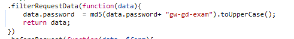
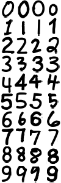
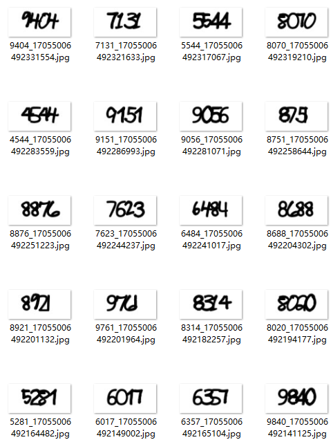
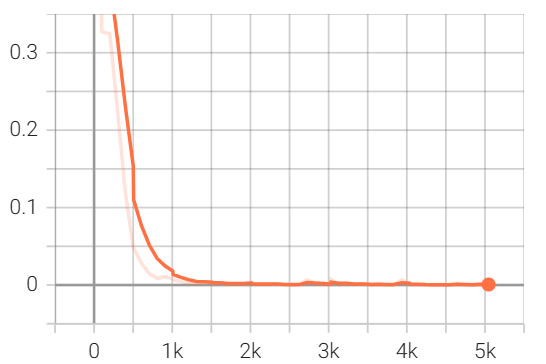
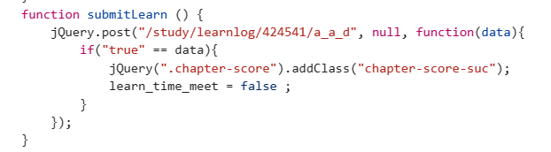
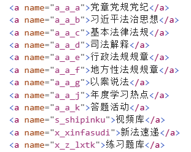

# scxfks
 四川省国家工作人员学法考法平台自动学习脚本

[四川学法平台](http://xxpt.scxfks.com/)每日自动学习5分，学满100分为止，包含验证码识别

- [x] 支持多账号
- [x] 只需要点一下就够了

# 安装
如果是单纯的使用不需要cuda也行，如果自行训练最好还是安装cuda
``` 
git clone https://github.com/Zuo1ji/scxfks.git
#不使用cuda
pip install pillow lxml requests torch torchvision tensorboard

#使用cuda请自行安装 
```
# 使用

1、在releases中下载 model.pth

2、修改main.py中 predict=Predict(r"path\to\your\model\path") 指向model.pth

3、修改users=[
        ['mobile0','password0'],
        ['mobile1','password1'],
    ]为自己的账号密码

4、python main.py
# 自行训练模型
自行训练模型最好使用支持cuda的GPU，显存>2G，CPU也支持，不过可能训练用时稍长，~~反正我没试过~~，预览loss使用的是tensorboard，使用方法自行百度

1、在releases中下载 datasets.rar 并解压到当前目录下

2、python predict.py

# 过程
这里简述一下[四川学法平台](http://xxpt.scxfks.com/)的大致学习、得分过程
## 登录
登录方法在网页的static/js/http/http-login.js?v1.2中。直接向/study/session发送post请求，请求数据为包含"mobile"、"password"、"captcha"的json格式数据，注意password为加了一个"gw-gd-exam"字符串后的md5加密数据



## 验证码训练
验证码直接向/study/captcha发送get请求，再送入到cnn里边识别。

这里验证码比较简单，为以下4x10个手写数字随机组合：



然后写脚本生成带标签的验证码图片，每个图片大小为47x100



训练直接扔到cnn里边，很快就收敛了



## 提交学习结果
平台提交学习结果也比较简单，直接是页面停留10s然后发送一个post：



其中a_a_d是课程分类，这里选择获取刑事类法律专题和民商事类专题，这两个专题课多足够学满100分，分类都是a_a_d：



## Q&A

- 为什么不多学几分？

因为后台锁了每天读文章学法只能得5分

